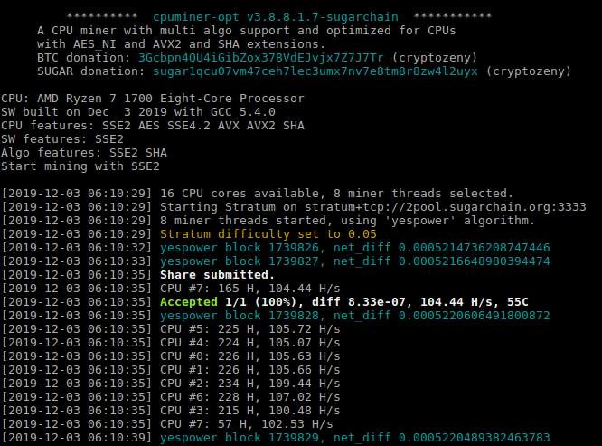

Optimized Cpuminer for Sugarchain using YespowerSugar (based on Yespower 1.0.0) 

## Download
- Version: cpuminer-opt-sugarchain-v3.8.8.1.7

<!-- tabs:start -->

####** Windows **

[Download](https://github.com/cryptozeny/cpuminer-opt-sugarchain/releases/download/v3.8.8.1.7rc1/cpuminer-opt-sugarchain-v3.8.8.1.7-w64.zip)


####** Linux **

[Source Code](https://github.com/cryptozeny/cpuminer-opt-sugarchain)

<!-- tabs:end -->

## Install
> [!Note]
>
>Tested on Ubuntu 16.04 & 18.04 & Debian 10

```bash
sudo apt-get install -y \
build-essential libssl-dev libcurl4-openssl-dev libjansson-dev libgmp-dev automake zlib1g-dev && \
git clone https://github.com/cryptozeny/cpuminer-opt-sugarchain.git && \
cd cpuminer-opt-sugarchain && \
./build-yespower.sh && \
./cpuminer --cputest
```

## Run
All address format (legacy, p2sh-segwit and ___bech32___) supported.

 * Mining Pool - `-t1` using 1 thread.
```
./cpuminer -a yespower -o stratum+tcp://1pool-testnet.cryptozeny.com:3333 -u tugar1qt9tcmdq7w002j8rw78h8nraj382ptqh7fe83f8 -t1
```

 * Solo - `44229` is testnet. `-u` and `-p` is on the coind. (adding `--no-longpoll` for displaying correct net_diff)
```
./cpuminer -a yespower -o http://localhost:44229 --no-longpoll -u rpcuser -p rpcpassword --coinbase-addr=tugar1qt9tcmdq7w002j8rw78h8nraj382ptqh7fe83f8 -t1
```

 * Screenshot


