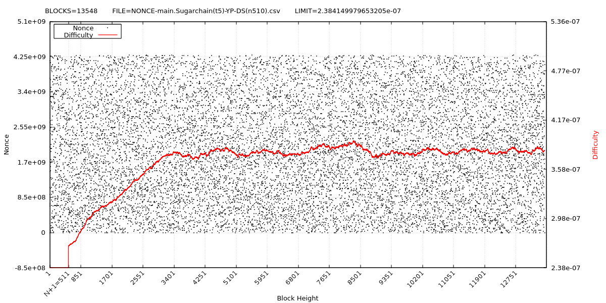

Sugarchain
==========
one-CPU-one-vote, the world's fastest PoW blockchain  
https://sugarchain.org

The meaning of Yumekawa
-----------------------
Sugarchain's first node software is called `Yumekawa (夢川)`. It can be translated in some ways.
 - "Yume (夢)" means dream and "Kawa (川)" means river. So it's `Dream River` in japanese.
 - The second letter "Kawa" stands for "Kawaii (可愛い)". In this case the meaning is `Dreamy Cute`.
 - Also Yumekawa replaces the word `Core` (ie: Bitcoin Core). We think it sounds a bit centralized.

Specifications
--------------
| | |
------------|------------
Block time: | `5` seconds
Difficulty: | SugarShield-N510 (based on Zcash's modification of Digishield)
Block reward: | `42.94967296` SUGAR
Halving interval: | `12,500,000` Blocks (approx. 2 years)
Total supply: | `1,073,741,824` SUGAR
PoW algorithm: | YespowerSugar (based on Yespower 1.0.1)
Port: | 34230 (RPC 34229)
Premine: | None (No ICO, No Presale, No Founder's rewards)

The world's fastest PoW blockchain
----------------------------------
- 5 seconds transaction speed
  * 120x faster than Bitcoin
  * 30x faster than Litecoin
  * 12x faster than Dogecoin
- Stable transaction time:
  * Even if the hash power suddenly increases, the block time remains 5 seconds. It is against hash attacks.
- Don't worry about orphan blocks: 
  * According to the testnet results, the average orphan rate is under 3% and no problem occurs.

A better halving
-----------------------------
- Halving is everything: 
  * Bitcoin is valuable because its total supply has been strictly limited, unlike traditional currencies. 
  * This total supply is controlled *only* by that halving. There is nothing else.
  * We made this halving better.
- Block reward: 
  * The block reward should be to a *power of two*, so that it halves correctly.
  * ie) `2^32/100000000 = 42.94967296 SUGAR`
- Halving schedule: 
  * Interval `12500000 blocks (5^8*32)` which is about 2 years (exactly 1.9818619989852864... years).
  * The total number of times halving will occur is `33 times`, over the span of `66 years`.
- Total supply: 
  * `1073741824 SUGAR` in theory, and `1073741823.875 SUGAR` in actual.
  * The difference is `0.125 SUGAR`. One Satoshi (0.00000001) limitation makes this difference. In addition, this number is meaningful. FYI: `1 GB = 1073741824 Byte (2^30)`.
  * The total supply of Sugarchain is about `51 times` greater than Bitcoin.
- Halving Chart: 
- Halving Table: 

one-CPU-one-vote
----------------
> "31/Oct/2008 Proof-of-work is essentially one-CPU-one-vote"

Satoshi Nakamoto talked about the importance of decentralized mining in his whitepaper. We want to create a blockchain that anyone can do mining easily without any entry barriers.

- CPU mining only
  * YespowerSugar (based on Yespower 1.0.1) is only for Sugarchain, not compatible with other Yespower coins.
  * The minimum difficulty (powlimit) is set low enough for two reasons. The first is to handle fast block time; The second is to allow mining on slow CPUs.
- Mining efficiency: 
  * According to the test results, the most efficient is using 8 threads on a single CPU.
  * YespowerSugar is more suitable for older CPUs, because it is essentially a multi-threading resistor. Suitable for smartphones and raspberrypi.
- NO GPU: GPU mining is not possible.
- NO ASIC: ASIC mining is not possible.

Other advantages
----------------
- Native segwit (Bech32) address built-in by default: Starting with `sugar1q...`
- Fast blockchain synchronization: Using sha256d in header indexing, the initial synchronization speed is as fast as Litecoin.

FAQ
---
- Disk space requirements: 
  * Blockchain size growth is around `10 MB per 1 day` and 3.65 GB per year.
- Network rules: 
  * To prevent fraud and timestamp attacks, nodes should be within `70 seconds` of accurate internet time, or they will be banned.
- Selfish mining & time warp attack: 
  * Fraud techniques for manipulating timestamps are already known. We use a future time limit (FTL) to prevent this. Blocks that differ `60 seconds` or more from the current head will be banned. (credit: zawy12)
- Exchange listing: 
  * We do not have a listing plan at this moment. However, it will be discussed in our community and will be listed in the future. If you have any suggestions for exchange websites, contact us.

Appendix
--------
- Block time vs difficulty at first launching on testnet
  * To keep the block time 5 seconds, SugarShield-N510 adjusts the difficulty level. Unlike the Zcash's modification version, we use a moving average of `510 blocks` (about 42.5 minutes). It counts from block 1, an adjustment is made at block 511, and the actual control begins at block 512. [(log: time-diff)](https://github.com/sugarchain-project/website/blob/master/log/time_vs_difficulty-13536.log)
  * 

- Nonce distribution at first launching on testnet 
  * The nonce is randomly well distributed. Difficulty changes but no bias. [(log: nonce-diff)](https://github.com/sugarchain-project/website/blob/master/log/nonce_vs_difficulty-13548.log)
  * 

License
-------
Sugarchain Yumekawa is released under the terms of the MIT license. See [COPYING](COPYING) for more
information or see https://opensource.org/licenses/MIT.
- Copyright (c) 2009-2010 Satoshi Nakamoto
- Copyright (c) 2009-2018 The Bitcoin Core developers
- Copyright (c) 2013-2019 Alexander Peslyak - Yespower 1.0.1
- Copyright (c) 2016-2018 The Zcash developers - DigiShieldZEC
- Copyright (c) 2018-2019 The Sugarchain developers
