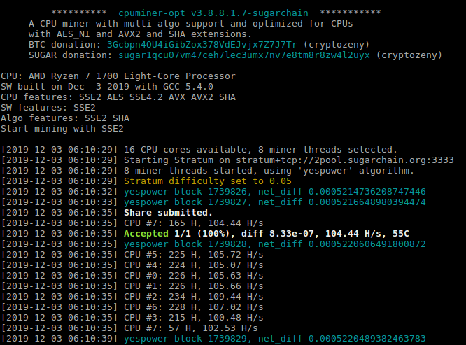

使用经YespowerSugar算法优化的Sugarchain专用版Cpuminer(基于Yespower 1.0.0)

## 下载
- 当前版本: cpuminer-opt-sugarchain-v3.8.8.1.7

<!-- tabs:start -->

####** Windows **

[下  载](https://github.com/cryptozeny/cpuminer-opt-sugarchain/releases/download/v3.8.8.1.7rc1/cpuminer-opt-sugarchain-v3.8.8.1.7-w64.zip)


####** Linux **

[源  码](https://github.com/cryptozeny/cpuminer-opt-sugarchain)

<!-- tabs:end -->

## 安装
> [!Note]
>
> Windows系统可直接下载运行文件,Linux需要自行编译
>
> 以下系统已通过官方测试 16.04 & 18.04 & Debian 10

```bash
sudo apt-get install -y \
build-essential libssl-dev libcurl4-openssl-dev libjansson-dev libgmp-dev automake zlib1g-dev && \
git clone https://github.com/cryptozeny/cpuminer-opt-sugarchain.git && \
cd cpuminer-opt-sugarchain && \
./build-yespower.sh && \
./cpuminer --cputest
```

## 运行
支持所有地址格式 (legacy, p2sh-segwit and ___bech32___) .

 * 连接矿池 - `-t1` 使用1线程.
```
./cpuminer -a yespower -o stratum+tcp://1pool-testnet.cryptozeny.com:3333 -u tugar1qt9tcmdq7w002j8rw78h8nraj382ptqh7fe83f8 -t1
```

 * 连接钱包Solo - `44229`为测试网端口. `-u` 与 `-p` 参数由钱包配置文件设定. (--no-longpoll` 参数可用于显示桂河大桥额的net_diff)
```
./cpuminer -a yespower -o http://localhost:44229 --no-longpoll -u rpcuser -p rpcpassword --coinbase-addr=tugar1qt9tcmdq7w002j8rw78h8nraj382ptqh7fe83f8 -t1
```

 * 软件截图


